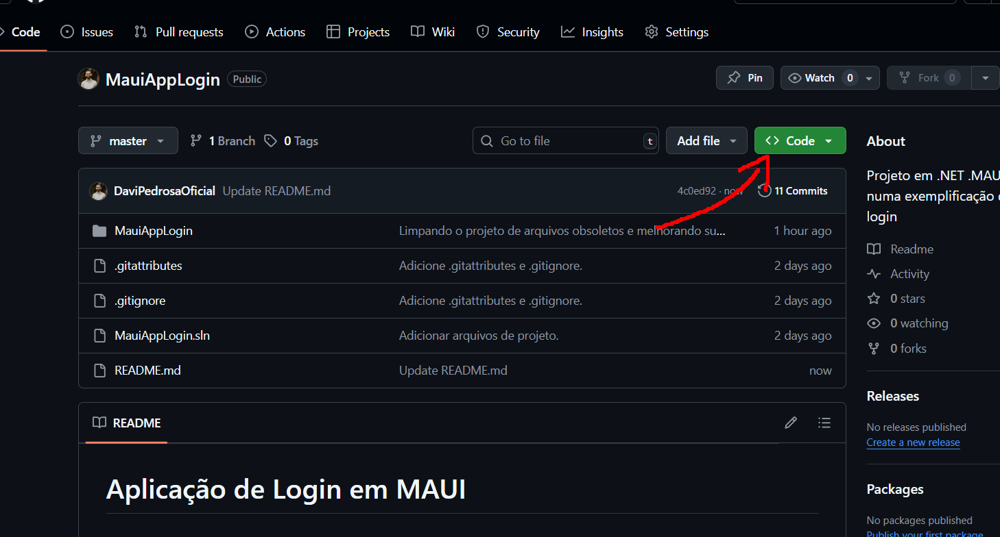
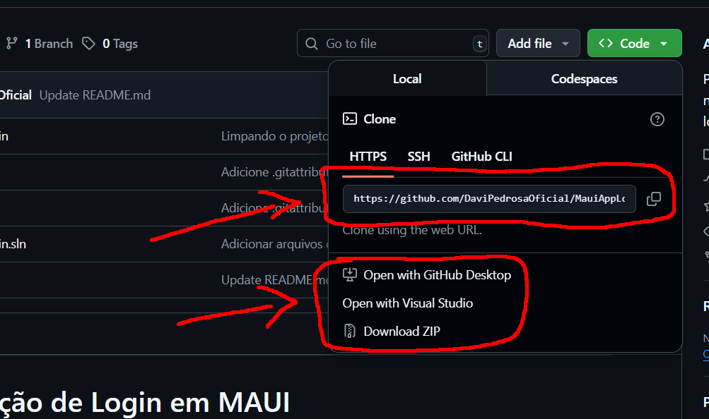
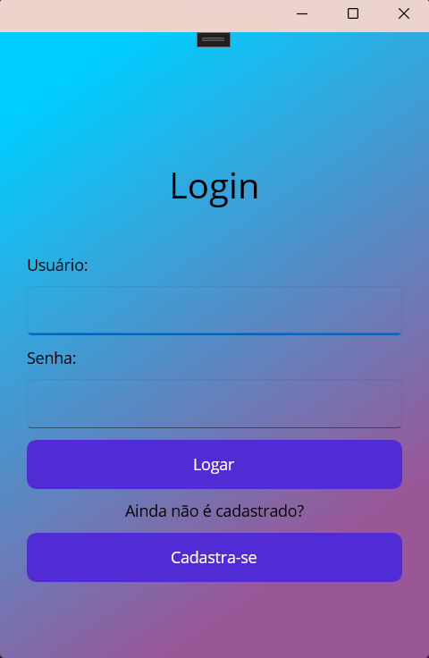
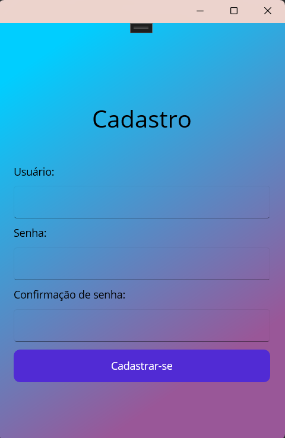
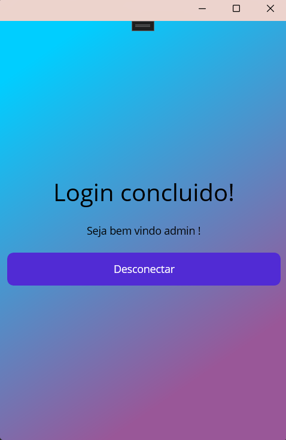

# Aplicação de Login em MAUI

## Descrição

 Projeto desenvolvido em C# utilizando sua framework .MAUI (desenvolvimento de softwares desktop & mobile).
 
 Projeto base que conta com uma interface de Login e Cadastro pré prontas para futuras aplicações utilizando o .MAUI.

 Pensando em futuras aplicações na framework, criei um sistema de Login básico que poderá ser reutilizado e alterado no futuro, onde o mesmo conta com alguns usuários já cadastrados e uma aba para cadastrarmos
 novos clientes. Além disso, o projeto já exclui grande parte dos arquivos obsoletos que são criados ao iniciarmos um novo projeto MAUI, uma vez que o mesmo também cria uma interface gráfica ao ser iniciado.
 O projeto também conta com diversos comentários para auxiliar no seu desenvolvimento.

 ### Requisitos

 <ul>
   <li>IDE de sua escolha: Visual Studio Community, JetRiders, ...</li>
   <li>SDK .NET: Utilizado no projeto é a 9.0. Nâo possui o .NET ainda? <a href="https://learn.microsoft.com/pt-br/dotnet/maui/get-started/installation?view=net-maui-9.0&tabs=visual-studio"     target="blank">Instalar SDK</a></li>
   <li>Extensão do .NET MAUI: Caso não tenha instalado, <a href="https://learn.microsoft.com/pt-br/dotnet/maui/get-started/installation?view=net-maui-9.0&tabs=visual-studio" target="blank">clique aqui</a></li>
 </ul>

 ### Instruções de para baixar o projeto

 <ol>
  <li>Clone ou Baixe o projeto a partir do botão <b>'code'</b> aqui no git 
   
   </li>
   <li>Escolha a melhor opção para baixá-lo em sua IDE
   
   <li>Após baixá-lo em sua máquina, peça para sua IDE rodar o mesmo, pra ver se existe alguma extensão que precisa ser instalada ainda.
    
   Se for preciso, o terminal acusará erro, e aconselhamos que pergunte ao Copilot que lhe ajude a instalar as extensões faltantes (caso seja necessário).</li>
   <li>Agora com o código pronto podemos explicar como o projeto funciona.</li>
 </ol>

 ### Instruções de uso do projeto

 Para que seja possivel utilizar o projeto, vamos entender como o mesmo funciona, em duas partes:

 <ol>
   <li><b>Estrutura de arquivos:</b>
    
    
   Se você reparar, nosso projeto contem 2 pastas extras além das criadas por padrão ao iniciarmos um novo projeto .MAUI: 
    
   > Services e Views.

    
    
   Onde dentro de nossa pasta Services, temos o arquivo <b>LoginService.cs</b>, que é responsável por gerenciar os usuários cadastrados no sistema, e a pasta Views, que contém as telas de Login e Cadastro.
    
    
   Na pasta de <b>Services</b>, você poderá alterar as regras de negócio do sistema, como por exemplo, adicionar novos usuários, regras para criar um novo usuário, interpolação com banco de dados, etc.
    
    
   Já na pasta <b>Views</b>, você encontrará os arquivos de interface gráfica, onde poderá alterar a aparência do sistema, como cores, fontes, imagens, e também a linkagem das mesmas e outras possíveis páginas que você desejar em seu projeto. etc.
    
    
   Os outros arquivos criados por padrão pelo .MAUI, como o App.xaml.cs, foram ligeiramente alterados para se encaixar ao conceito do projeto,
   mas você pode alterá-los como desejar, uma vez que todas as alterações foram descritas através de comentários para auxiliar a compreensão.
    
    
   Lembrandro que o projeto é um exemplo básico de como utilizar o .MAUI, e não possui uma lógica de negócio complexa, portanto, sinta-se livre para alterá-lo como desejar.
   </li>

    
    
   <li><b>Utilização na prática (janelas do projeto) :</b>

   Ao pedirmos a nossa IDE para rodar o projeto, ela irá abrir uma janela de Login, onde você poderá utilizar os seguintes usuários já cadastrados:
   > Usuario = "admin", Senha = "123"  
   > Usuario = "user", Senha = "123"  
   > Usuario = "guest", Senha = "123"

    
    
   Onde os mesmos possuem acesso padrão ao nosso sistema, onde caso você logar com os mesmos, será diferecionado a tela 'Protegida', onde poderá deslogar.
    
    
   Além disso, em nossa tela de Login, você encontrará um botão 'Cadastrar', onde ao clicar, será direcionado a tela de Cadastro, onde poderá cadastrar novos usuários para o sistema, onde ao cadastrar-se, automaticamente será direcionado a tela 'protegida'.
    
    
   E por fim, o nosso projeto conta também com algumas condições de erro, como por exemplo, caso o usuário não exista, ou a senha esteja incorreta, o sistema irá acusar o erro e não permitirá o acesso ao sistema. Buscando sempre manter a segurança do sistema.
 </ol>

 Outro ponto interessante de nosso projeto se diz respeito a sua portabilidade, uma vez que o mesmo foi desenvolvido utilizando o .MAUI, ele pode ser executado em diversas plataformas, como Windows, MacOS, Android e iOS, sem a necessidade de grandes alterações no código.
 
 Caso você tenha interesse em aprender mais sobre o .MAUI, recomendo que acesse a documentação oficial do .NET MAUI, onde você encontrará diversos tutoriais e exemplos de como utilizar a framework: <a href="https://learn.microsoft.com/pt-br/dotnet/maui/" target="blank">Documentação Oficial</a>.

 Deixarem também o link da documentação que te auxiliará a configurar o emulador Android em seu Visual Studio, onde o mesmo explica como criar um novo emulador e assim você poderá ver em tempo real como seu projeto .MAUI esta ficando no android: <a href="https://learn.microsoft.com/pt-br/dotnet/maui/android/emulator/device-manager?view=net-maui-9.0" target="blank">Clique aqui</a>.
    git commit
 ## Algumas imagens do projeto:

 Tela de Login:
  
  
 
  
  
 Tela de Cadastro:
  
  
 
  
  
 Tela Protegida (após login):
  
  
 

 ## Considerações finais

 Lembrando mais uma vez que o projeto é um exemplo básico de como utilizar o .MAUI, e não possui uma lógica de negócio complexa, portanto, sinta-se livre para alterá-lo como desejar.
 E caso tenha alguma dúvida ou sugestão, sinta-se à vontade para entrar em contato comigo através do meu e-mail: <a href="mailto:pedrosassss@hotmail.com">pedrosassss@hotmail.com</a>:
